[NIEHS-STRIDES/ToxPipe Channel](https://teams.microsoft.com/l/channel/19%3a5aa8e5c5ac6a400da6b57916a96083ee%40thread.skype/ToxPipe?groupId=af61690e-7397-48d4-947c-8a0444e36e90&tenantId=14b77578-9773-42d5-8507-251ca2dc2b06)

# ToxPipe

Our research project aims to explore the use of expert entrained AI-based systems for the rapid analysis and interpretation of toxicological properties of various compounds. By leveraging cutting-edge semi-autonomous AI systems, ToxPipe will enable scientists and toxicologists to explore diverse types of toxicologically relevant data through natural language instructions. Further, through use of expert entrainment ToxPipe will provide context generation that will act as an expert guide to novel, contemporary data streams that were previously challenging to access and integrate into toxicological characterization.  Examples of success in the area of expert entrained AI models include Auto-GPT and JARVIS (aka HuggingGPT) both of which employ OpenAI’s GPT-based models as a controller to connect fine-tuned, expert AI models. These projects enable AI to solve complicated tasks using plain language as a generic interface. As a world leader in toxicological assessment and reporting, the Division of Translational Toxicology at NIEHS is ideally positioned to identify the diverse and relevant domain space training data and to critically evaluate the expert entrained AI model. We will also investigate the ethical considerations of using generative AI for these purposes.

Following in the steps of [ChemCrow](https://arxiv.org/abs/2304.05376), ToxPipe will build and experiment with various language models as expert agents. The agents will be trained on a variety of toxicology data sets, and will be able to perform a variety of tasks in toxicology. The agents will be able to perform tasks such as:

- Predicting toxicity of a compound given a set of conditions
- Generate toxicological narratives
- Answer questions about toxicology

ToxPipe aims to repurpose semi-autonomous AI agents to explore existing toxicological data and literature using in-context learning. Some of the tasks that we believe are possible with this system are generation of toxicological narratives with deep explanatory context, analysis of chemical structure, analysis of biological assay results, summarization of journal abstracts, biological database exploration using text-to-SQL AI models, and a variety of other tasks that currently require large amounts of human time and labor. By offloading these tasks to autonomous agents, it would allow toxicologists to repurpose their time towards higher-level cognitive tasks of directing the AI towards specific outputs.

## System Architecture

The following diagram demonstrates an overall structure of ToxPipe. This model is subject to change as the project develops.



This stack is currently in flux and is subject to change. The current stack is as follows:

- topipe
  - nginx | 80:80, 443:443
  - heimdall | 81:80, 444:443
- [toxpipe-supabase](https://gitlab.niehs.nih.gov/bsb/toxpipe-supabase)
  - kong | 8000:8000, 8443:8443
    - supabase-auth
    - supabase-realtime
    - supabase-functions
    - supabase-postgrest | 3000
    - supabase-storage | 5000
    - imgproxy | 8080
  - postgres | 5432:5432
  - studio | 3000:3000 Not reverse-proxied for security, must ssh tunnel
- [dialoqbase](https://gitlab.niehs.nih.gov/bsb/dialoqbase)
  - 3000:3000
- [agixt](https://gitlab.niehs.nih.gov/bsb/AGiXT/)
  - 8501:8501 | Streamlit frontend
  - 7437:7437 | API

Stack decisions are saved in [`docs/decisions`](docs/decisions/index.md). This is where we will document the reasoning behind our stack decisions.

## Deployment

TODO: Stack will automatically be deployed from the `prod` branch of this repo. This will be done through GitLab CI/CD.
Currently deployed on ehsdttlp30 using Docker Compose for each individual repository. 

### ToxPipe Supabase Deployment
```
cd /toxpipe/toxpipe-supabase/docker
docker compose up -d
```

### Dialoqbase Deployment
```
cd /toxpipe/dialoqbase/docker
docker compose up -d
```

### AGiXT Deployment
```
cd /toxpipe/AGiXT
docker compose up -d
```

### ToxPipe Deployment
```
cd /toxpipe/toxpipe/.build
docker compose up -d
```

## GitLab Repo is source of truth

Deployment to ehsdttlp30will be mananged from here. Build tools are all through GitLab. Gitlab was chosen due to GitLabs CI/CD capabilities. Azure Cloud is needed for OpenAI API access.


## Useful Links

- <https://github.com/Azure/azure-quickstart-templates>
- <https://aztfmod.github.io/documentation/>
- <https://github.com/microsoft/JARVIS>
- <https://github.com/Azure/Azurite>
- <https://github.com/mlflow/mlflow>
- <https://github.com/microsoft/DeepSpeed>
- <https://codeql.github.com/>

## Repo Structure

- `.build`: This folder should contain all scripts related to build process (PowerShell, Docker compose…).
- `.config`: It should local configuration related to setup on local machine.
- `dep`: This is the directory where all your dependencies should be stored.
- `doc`: The documentation folder
- `res`: For all static resources in your project. For example, images.
- `samples`: Providing “Hello World” & Co code that supports the documentation.
- `src`: The source code folder! However, in languages that use headers (or if you have a framework for your application) don’t put those files in here.
- `test`: Unit tests, integration tests… go here.
- `tools`: Convenience directory for your use. Should contain scripts to automate tasks in the project, for example, build scripts, rename scripts. Usually contains .sh, .cmd files for example.

## Additional Notes
### Azure Cloud

Hosting inference endpoints, documents, databases, orchistrator agent, etc.

### BioWulf and NIEHS HPC

Will be used to train the expert models using apptainer, mlflow, and DeepSpeed.