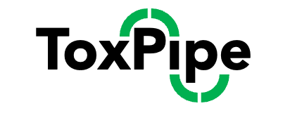
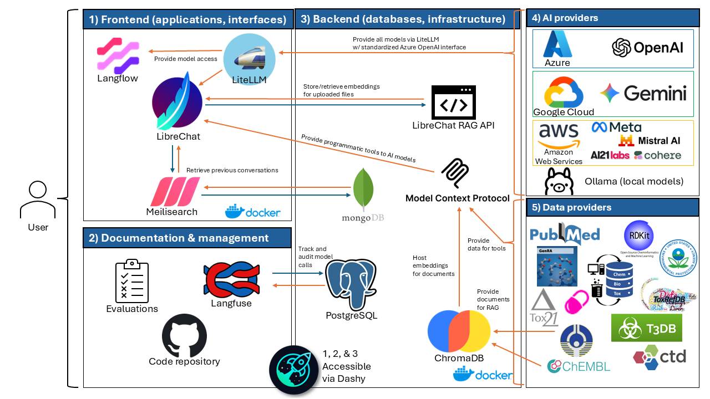

<!--
*** Thanks for checking out the Best-README-Template. If you have a suggestion
*** that would make this better, please fork the repo and create a pull request
*** or simply open an issue with the tag "enhancement".
*** Don't forget to give the project a star!
*** Thanks again! Now go create something AMAZING! :D
-->

<!-- PROJECT LOGO -->

  
  <h1 align="center">ToxPipe: Semi-autonomous AI integration of diverse toxicological data streams</h1>

<!-- PROJECT SHIELDS -->
<!--
*** I'm using markdown "reference style" links for readability.
*** Reference links are enclosed in brackets [ ] instead of parentheses ( ).
*** See the bottom of this document for the declaration of the reference variables
*** for contributors-url, forks-url, etc. This is an optional, concise syntax you may use.
*** https://www.markdownguide.org/basic-syntax/#reference-style-links
-->

<!-- TABLE OF CONTENTS -->

  
🗂️ Table of Contents

  <ol>
    <li><a href="#what-is-toxpipe">What is ToxPipe?</a></li>
    <li><a href="#approach">Approach</a></li>
    <li><a href="#system-architecture">System Architecture</a></li>
    <li><a href="#deployment">Deployment</a></li>
    <li><a href="#useful-links">Useful Links</a></li>
    <li><a href="#repo-structure">Repo Structure</a></li>
    <li><a href="#funding-sources">Funding Sources</a></li>
  </ol>

## 🤔 What is ToxPipe?

ToxPipe is an ecosystem of open-source software that aims to explore the use of large language models (LLMs) for the rapid analysis and interpretation of toxicological properties of various compounds. By leveraging these cutting-edge semi-autonomous AI systems, ToxPipe enables scientists and toxicologists to explore diverse types of toxicologically relevant data through natural language instructions. Further, through the provision of curated data streams as additional context for models, ToxPipe integrates novel, contemporary data streams that were previously challenging to access and use in toxicological characterization.

ToxPipe is meant to be a platform for interacting with various toxicological data streams. It comprises multiple components and, like any agentic retrieval augmented generation (RAG) system, requires managing agents, states, prompts, database connections, APIs, and other systems.

    <a href="#readme-top" style="text-decoration: none; color: #007bff; font-weight: bold;">
        ↑ Back to Top ↑
    </a>

## Approach

LLMs, such as [OpenAI’s GPT models](https://openai.com/blog/chatgpt), can be used to solve complicated tasks with natural language as a generic interface. By using techniques like retrieval augmented generation (RAG) and model context protocol (MCP)-based tools, LLMs can be given a set of instructions and can (semi-)autonomously explore various data sources. LLMs can then generate responses or interpretations based on information stored inside the models (pretrained data) along with the contextual data retrieved through external streams like RAG and tool calls.

ToxPipe aims to repurpose (semi-)autonomous AI agents for AI-augmented exploration of existing toxicological data and literature. Some of the tasks that we believe are possible with autonomous agents and RAG are:

- Generation of toxicological narratives with deep explanatory context
- Analysis of chemical structure
- Analysis of biological assay results
- Summarization of journal abstracts
- Biological, chemical, and toxicological database exploration
- A variety of other tasks that currently require large amounts of human time and labor

By offloading these tasks to ToxPipe, it would allow toxicologists to redirect their time towards higher-level cognitive tasks of directing the AI towards specific outputs.

    <a href="#readme-top" style="text-decoration: none; color: #007bff; font-weight: bold;">
        ↑ Back to Top ↑
    </a>

## System Architecture

The following diagram demonstrates an overall structure of ToxPipe. This model is subject to change as the project develops.

    <a href="#readme-top" style="text-decoration: none; color: #007bff; font-weight: bold;">
        ↑ Back to Top ↑
    </a>

## Deployment

Deployment information is contained at [`docs/docker-setup-readme.md`](docs/docker-setup-readme.md).

    <a href="#readme-top" style="text-decoration: none; color: #007bff; font-weight: bold;">
        ↑ Back to Top ↑
    </a>

## Related Repositories

- [ToxPipe LLM Model Comparison](https://github.com/NIEHS/ToxPipe-Model-Comparison) - Evaluations for the various models supported by ToxPipe
- [ToxPipeMCP](https://github.com/NIEHS/ToxPipeMCP) - MCP server providing various toxicological tools to LLMs
- [ToxPipeMCP-Suite](https://github.com/NIEHS/ToxPipeMCP-Suite) - Additional MCP servers providing broader data access to LLMs
- [ToxPipeRAG](https://github.com/NIEHS/ToxPipeRAG) - Embeddings database built from chemical and technical reports from ChEMBL and the NTP for use in RAG
- [ChemBioTox-API](https://github.com/NIEHS/ChemBioTox-API) - REST API for interfacing with ChemBioTox, a database of experimental and predicted toxicological data for over 1 million chemicals

    <a href="#readme-top" style="text-decoration: none; color: #007bff; font-weight: bold;">
        ↑ Back to Top ↑
    </a>

## Repo Structure

- `.litellm`: Configuration related to LiteLLM, a provider-agnostic proxy for accessing various LLMs through a unified interface
- `dashy`: Configuration related to Dashy, a dashboard software for providing a singular interface for accessing ToxPipe's services 
- `docs`: Documentation and guides
  - `docker-setup-readme.md`: Main guide for deploying ToxPipe using Docker Compose
  - `dyad-setup-readme.md`: Guide for configuring ToxPipe models to work with [Dyad](https://www.dyad.sh/), a desktop application for vibe-coding
  - `niehs-certificate-readme.md`: Guide for configuring SSL certificates for proper access to the NIEHS-hosted ToxPipe models
  - `ollama-readme.md`: Guide for installing and hosting local AI models through Ollama
  - `toxpipe-security-readme.md`: Security recommendations for hosting a public ToxPipe deployment
- `dozzle`: Configuration related to Dozzle, a service for monitoring Docker containers
- `examples`: Example code and vignettes for common use cases
- `models`: Storage of locally-downloaded AI models from Ollama
- `ntp_docs_rag_db`: Data directory for ChromaDB data for [ToxPipeRAG](https://github.com/NIEHS/ToxPipeRAG)
- `ollama`: Configuration related to Ollama, a software for managing and hosting local AI models
- `traefik`: Configuration related to Traefik, a reverse proxy service
- `docker-compose.mcp.yml`: Docker compose file for the [ToxPipeMCP](https://github.com/NIEHS/ToxPipeMCP) component of ToxPipe - this may be deployed standalone
- `docker-compose.yml`: Docker compose file for all other constituent services for ToxPipe
- `env.example`: Example `.env` file for setting environment variables for the ToxPipe Docker Compose environment
- `librechat.yaml`: Configuration related to LibreChat, a ChatGPT-like interface for conversing with LLMs and agents

    <a href="#readme-top" style="text-decoration: none; color: #007bff; font-weight: bold;">
        ↑ Back to Top ↑
    </a>

## Funding Sources

This work was funded by the National Institutes Health (NIH) under the following grants:

- [NOT-OD-23-070: Notice of Special Interest (NOSI): Administrative Supplements to Support the Exploration of Cloud in NIH-supported Research](https://grants.nih.gov/grants/guide/notice-files/NOT-OD-23-070.html)
