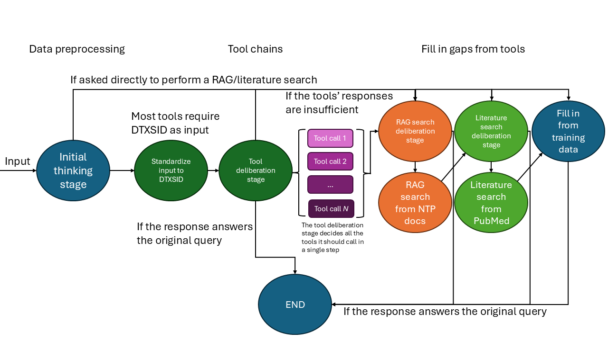

# Challenges

## Slow Performance / High Latency

### Reducing Output Tokens
ToxPipe's latency when accessing the LLM API was reduced by encouraging the model to generate shorter responses, as per [OpenAI's documentation](https://platform.openai.com/docs/guides/latency-optimization). This was primarily done by explicitly stating token/character limits during prompt engineering.

The following stipulations were included in the system prompt:

```python
"""
Only include a part in your final answer if you were able to find information from that part. For example, if you were only able to find information from tools and training data, you should only include those two parts in your final answer.

Important: The text in each part MUST not exceed 500 characters. Summarize the data if necessary to meet this requirement, but make sure to retain important and specific information relevant to the original query.

Important: the entire final answer must not exceed 2 paragraphs (around 2000 characters).
"""
```

### Pruning Context
As per [OpenAI's documentation](https://platform.openai.com/docs/guides/latency-optimization), trimming the LLM input may be helpful to slightly improving speed. With agents that may potentially make many tool calls per run, the context size can explode quickly, especially when making repeat calls to the same agent. We included a "condense prompt" step before the model call to prune messages from the context (after the initial system prompts to retain base instructions) until the context is under a configurable maximum number of tokens.

```python
def condense_prompt(prompt: ChatPromptValue) -> ChatPromptValue:        
        messages = prompt.to_messages()
        num_tokens = llm.get_num_tokens_from_messages(messages)
        ai_function_messages = messages[2:]
        if max_memory_tokens > 0: # When 0, don't trim the context window
            while num_tokens > max_memory_tokens:
                ai_function_messages = ai_function_messages[2:]
                num_tokens = llm.get_num_tokens_from_messages(
                    messages[:2] + ai_function_messages
                )
        messages = messages[:2] + ai_function_messages # append the first two messages (system and human) to the trimmed list of internal messages

        # Prune any tool messages without a tool call
        tool_messages = [message.tool_call_id for message in messages if isinstance(message, ToolMessage)]
        tool_call_messages = [[i['id'] for i in message.tool_calls] for message in messages if isinstance(message, AIMessage) and message.tool_calls]
        tool_call_messages = list(itertools.chain.from_iterable(tool_call_messages)) # flatten the list of tool call messages
        good_tool_calls = list(set(tool_messages) & set(tool_call_messages)) # get only tool calls that have a corresponding tool message
        pruned_messages = []
        for message in messages:
            if isinstance(message, ToolMessage) and message.tool_call_id not in good_tool_calls:
                continue
            elif isinstance(message, AIMessage):
                if message.tool_calls:
                    ids = [call["id"] for call in message.tool_calls]
                    bad_ids = [id for id in ids if id not in good_tool_calls]
                    if len(bad_ids) > 0:
                        continue
                    else:
                        pruned_messages.append(message)
                else:
                    pruned_messages.append(message)
            else:
                pruned_messages.append(message)
        messages = pruned_messages
        return ChatPromptValue(messages=messages)
```

### Using Shallow Checkpointing
We used LangChain's [ShallowPostgresSaver](https://langchain-ai.github.io/langgraph/reference/checkpoints/#langgraph.checkpoint.postgres.BasePostgresSaver.aput) instead of the PostgresSaver as the shallow version does not retain checkpoint history. We hoped this would reduce checkpointing latency, but we did not see noticeable improvements since checkpointing is already fairly quick.

### Using a Single "Tools Stage"
We noticed that LangChain's provided premade agent would repeatedly alternate between making tool calls and deliberating the next step until it ran out of iterations or answered the user's query. However, we also noticed that the premade agents could make multiple tool calls in a single deliberation stage. We developed a custom agent that instead would only perform a single tool calling step. This allowed for agents that produced fewer and less redundant tool calls, leading to shorter and cheaper runs. We found that this single tool calling step produced sufficient answers when combined with RAG/literature searches and training data later in the pipeline.

### Caching
Several caching measures were taken to improve LLM call speed and price. 

1. Use [checkpointing](### Using Shallow Checkpointing) to persist graph state [(see LangChain documentation)](https://langchain-ai.github.io/langgraph/reference/checkpoints/#langgraph.checkpoint.base.Checkpoint.channel_values).
2. Create cache for agents to avoid having to reinitialize agents on repeated calls.
3. Include the following clause in the system prompt: 
```python
"""
If the answer to the query exists in your memory, you may skip tool or search usage and provide the answer directly.
"""
```

## Inconsistent Output

### Prompt Examples
We were able to encourage the LLMs to produce output in a specific format by explicitly providing an example of an expected final response in the system prompt:
```python
"""
- Example:
    ** Tools **
    ** Topic 1 **
    (summary of data related to topic 1 from tools with sources)
    ** Topic 2 **
    (summary of data related to topic 2 from tools with sources)
    ...
    ** Topic N **
    (summary of data related to topic N from tools with sources)
    ** RAG **
    (summary of data from RAG search with sources)
    ** Literature **
    (summary of data from scientific literature search with sources)
    ** Training Data **
    (summary of data from training data with warning that data was generated from training data)
"""
```

We also provided a JSON example for the expected output of each deliberation stage in the system prompt. This format worked well for Azure OpenAI's ```azure-gpt-4o``` and Anthropic's ```claude-3-5-sonnet``` models:

```python
"""
- Example:
    ```json
    {{
        "thought": (current progress and next steps),
        "action": (action or tool to use),
        "action_input": (input for the tool or action),
    }}
    ```
"""
```

We found that Google's ```gemini-1.5-pro``` model had trouble producing tool input(s) in the proper format, so we had to use a more explicit example for that architecture:

```python
"""
- Example:
    ```json
    {{
        "thought": (current progress and next steps),
        "action": (tool name to use next),
        "action_input": {{"parameter1": "value1", "parameter2": "value2"}},
    }}
    ```
"""
```

### Optimizing Tool Outputs
Most of the tools available to Toxpipe agents interface with the ChemBioTox database via the [ChemBioTox API](https://rstudio.niehs.nih.gov/chembiotox-api/) ([code repository available here](https://github.com/combspk/chembiotox-api)). As part of ongoing development of that project, we made various changes to the endoints of the ChemBioTox API to produce shorter, better curated, and more relevant responses. This was done to avoid making the LLM have to generate an expensive and long response when it retrieves a large amount of data from the API.

### Standardizing Input
We designed the majority of the agent's tools that interface with the ChemBioTox API to accept a chemical's DSSTox Substance ID as input. This is to avoid having the model be required to translate user input based on tool. Prior to calling these tools, we force the agent to map the user's input to a DSSTox Substance ID using a separate set of "translation tools.

### Separation of Responsibility
We noticed that with LangChain's base agent, tool calls were inconsistent across runs. To solve this, we designed our pipeline logic as follows and implemented it into the graph structure of our custom agent. This helps force the agent to prioritize quicker-to-access, easier-to-cite data in its responses:

0. START
1. Accept user input
2. Translate user input to known DTXSID
3. Deliberate which ChemBioTox-interfacing tools to call (the data produced by these tools have known sources and are thus "reliable", so we prioritize them)
4. Perform tool calls
5. Determine if the tool response(s) sufficiently answer the user's query
    1. Yes: move to end state
    2. No: move to RAG deliberation stage
6. Perform RAG search (sources are also known for the RAG search, but this can take longer than tool use, so it is second-priority)
7. Determine if the RAG response sufficiently answers the user's query
    1. Yes: move to end state
    2. No: move to literature deliberation stage
8. Perform literature search (sources are also known for the literature search, but this can be quite slow, so it is third-priority)
9. Determine if the literature response sufficiently answers the user's query
    1. Yes: move to end state
    2. No: move to training data answer generation stage
10. Generate answer from training data (sources are unknown for answers generated from training data - although the LLM may cite a source, one must manually verify if the citation is correct or if the source exists)
11. END



### Enabling LLM Tool Support and Output Parsing
Early versions of ToxPipe's agents were developed and tested with the ```azure-gpt-4o``` model. However, not all LLM architectures are immediately compatible with the base LangChain agent. This required us to handle models on a case-by-case basis to help them better use available tools. 

The following is a custom parser we implemented based on LangChain's ```JsonOutputParser``` that is designed to specifically force a tool call in the same way as when using Azure OpenAI models when using Anthropic models.

```python
class AnthropicDeliberationOutputParser(JsonOutputParser):
    def __init__(self, output_parser=DeliberationSchema):
        super().__init__(pydantic_object=output_parser)

    def parse_result(self, result: list[AIMessage], *, partial: bool = False) -> Any:
        """Parse the result of an LLM call to a JSON object.

        Args:
            result: The result of the LLM call.
            partial: Whether to parse partial JSON objects.
                If True, the output will be a JSON object containing
                all the keys that have been returned so far.
                If False, the output will be the full JSON object.
                Default is False.

        Returns:
            The parsed JSON object.

        Raises:
            OutputParserException: If the output is not valid JSON.
        """
        text = result[-1].text
        text = text.strip()
        tool_call_message = result[-1].message
        if not tool_call_message.tool_calls:
            # Parse out tools and input
            tool_names = tool_call_message.content

            # Strip preamble to JSON
            json_start = tool_names.find("{")
            if json_start != -1:
                tool_names = tool_names[json_start:]
                try: 
                    json.loads(tool_names)
                except json.JSONDecodeError as e:
                    tool_names = tool_names[:e.pos]

            tool_names = json.loads(tool_names)

            # Parse out the tool names and inputs
            param_name = tool_names["action"]
            param_input = tool_names["action_input"]
            param_id = result[-1].message.id

            result[-1].message.additional_kwargs["tool_calls"] = [
                {
                    "id": str(param_id),
                    "function": {
                        "arguments": param_input,
                        "name": str(param_name),
                    },
                    "type": "function"
                }
            ]

            result[-1].message.tool_calls = [
                {
                    "name": str(param_name),
                    "args": param_input,
                    "id": str(param_id),
                    "type": "tool_call"
                }
            ]

        result[-1].message.content = ""

        return result[-1].message

    def parse(self, text: str) -> Any:
        """Parse the output of an LLM call to a JSON object.

        Args:
            text: The output of the LLM call.

        Returns:
            The parsed JSON object.
        """
        return self.parse_result([Generation(text=text)])
```

### Forcing Tool Use
We identified an issue when using Anthropic and Google LLMs with agents where they would occasionally call incorrect tools in the RAG and literature search stages. The following code from our custom output parser forces the LLM to call the RAG or literature tool in their respective stages.

```python
if len(agent_tool_call_names) == 0: # Force the model to use the RAG tool
  response.tool_calls = [{'name': 'QueryRAG', 'args': {'q': str(user_query)}, 'id': str(agent_tool_call_ids[0]), 'type': 'tool_call'}]
  response.additional_kwargs["tool_calls"] = [{'id': str(agent_tool_call_ids[0]), 'function': {'arguments': {'q': str(user_query)}, 'name': 'QueryRAG'}, 'type': 'function', 'index': 0}]

if len(agent_tool_call_names) == 0: # Force the model to use the Literature search tool
  response.tool_calls = [{'name': 'LiteratureSearch', 'args': {'query': str(user_query)}, 'id': str(agent_tool_call_ids[0]), 'type': 'tool_call'}]
  response.additional_kwargs["tool_calls"] = [{'id': str(agent_tool_call_ids[0]), 'function': {'arguments': {'query': str(user_query)}, 'name': 'LiteratureSearch'}, 'type': 'function', 'index': 0}]
```

### Message Type Constraints
LangChain seems to not function correctly unless tool parameters are explicitly typed in their ```_run``` function's headers. For example:

```python
class Name2DTXSID(BaseTool):
    name: str = "Name2DTXSID"
    description: str = "Input a chemical name to return the DTXSID for that chemical from the ChemBioTox database."

    def __init__(
        self,
    ):
        super().__init__()

    def _run(self, name: str) -> str:
        pass
```

### Doing More Work in Code
We wanted to perform much of the computational and data fetching/generation tasks via code rather than offloading them to the LLM in order to reduce stochasticity in model responses. 