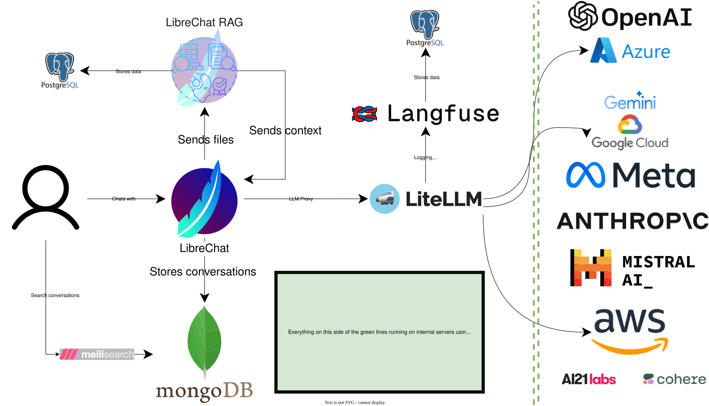

<!-- TODO: Add image -->

## Overview

ToxPipe is a platform for interacting with toxicological data using large language models (LLMs). It is comprised of various components that can function independently. The primary components are access to LLMs, either through a cloud provider or locally installed, a web interface for chatting with LLMs, databases for storing chats and research data, and agents that perform various actions on the data.

## Librechat

LibreChat is a platform for interacting with LLMs. It is comprised of a frontend, a backend, and a database. The frontend is a web interface that allows users to interact with LLMs through a chat window. The backend is an API that serves the frontend. The database stores chats between users and LLMs.

### MongoDB

MongoDB is a document-oriented database that stores chats between users and LLMs.

## Librechat RAG

LibreChat RAG is a platform for ingesting and processing documents for retrieval through the Librechat interface.

### PostgreSQL

PostgreSQL is a relational database management system (DBMS) that stores documents for retrieval through the Librechat interface.

## LiteLLM

LiteLLM is an LLM proxy that serves as a lightweight wrapper around LLMs that can be used in Librechat or in other contexts. It provides access to LLMs through a REST API, allowing them to be accessed from anywhere.

## Langfuse

Langfuse is an open-source LLM engineering platform that helps teams collaboratively debug, analyze, and iterate on their LLM applications.

### PostgreSQL

PostgreSQL is a relational database management system (DBMS) that stores information for retrieval through the Librechat interface.

## LLMs

LLMs are large language models (LLMs) that can be used in Librechat or in other contexts. LLMs are accessed through LiteLLM but originate from various sources, including cloud providers and locally-hosted models.

## Ollama

Ollama is a streamlined tool for running open-source LLMs locally, including Mistral and Llama 2. Ollama bundles model weights, configurations, and datasets into a unified package managed by a Modelfile.

