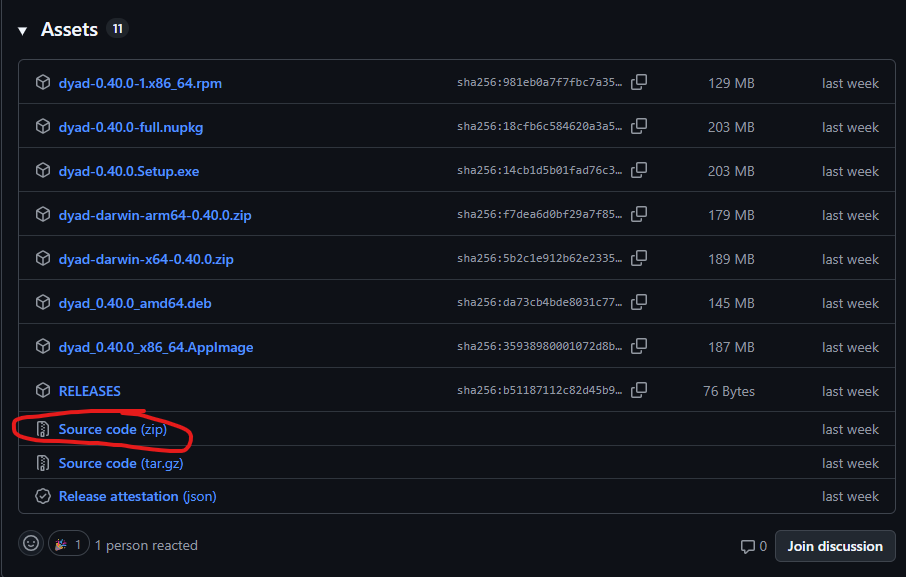
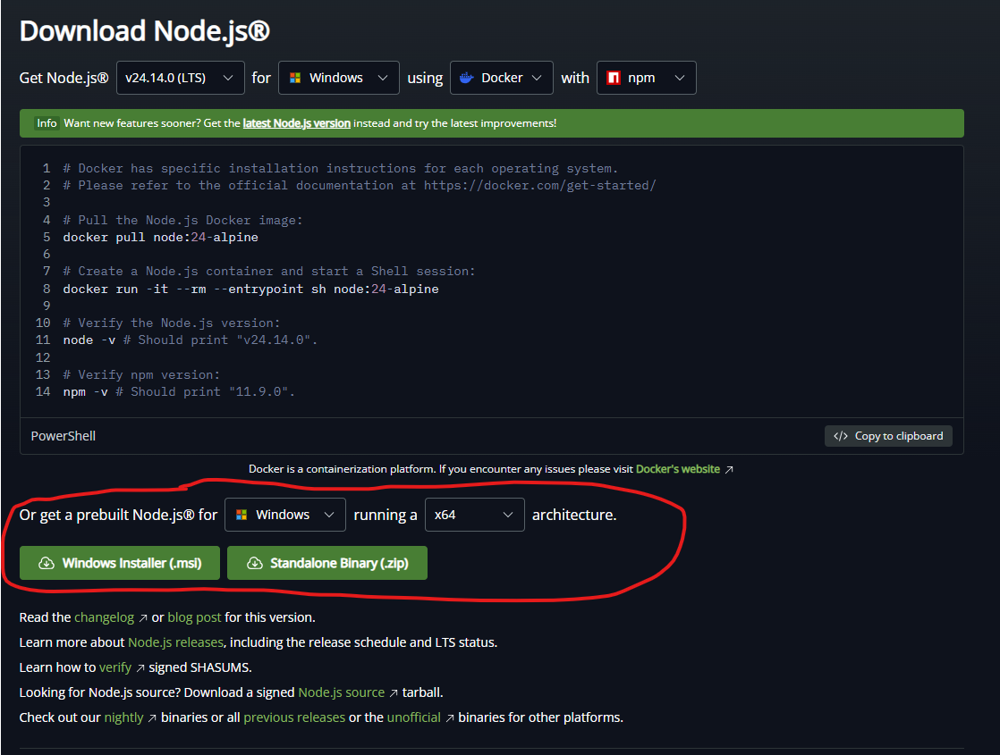
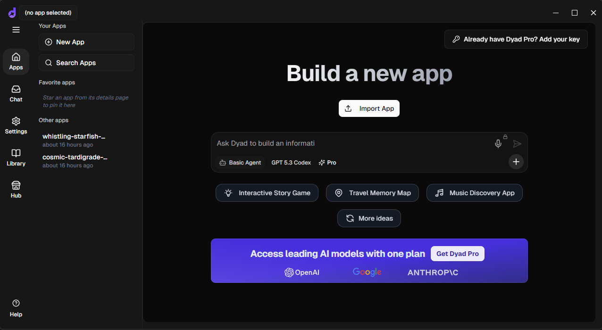
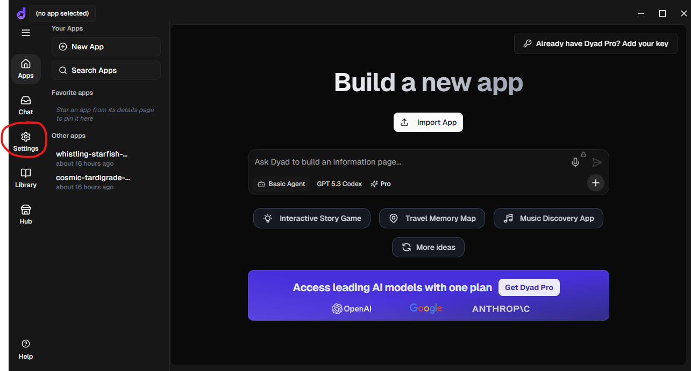
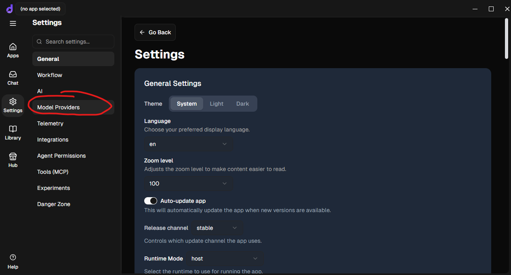
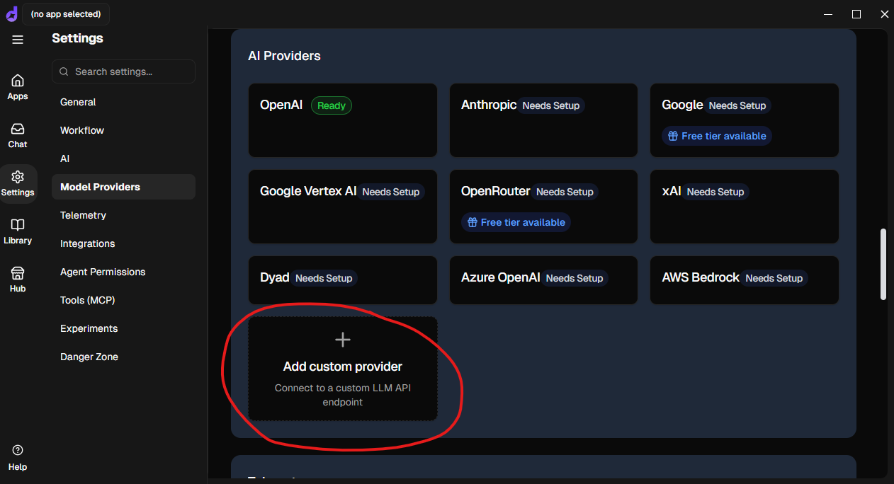
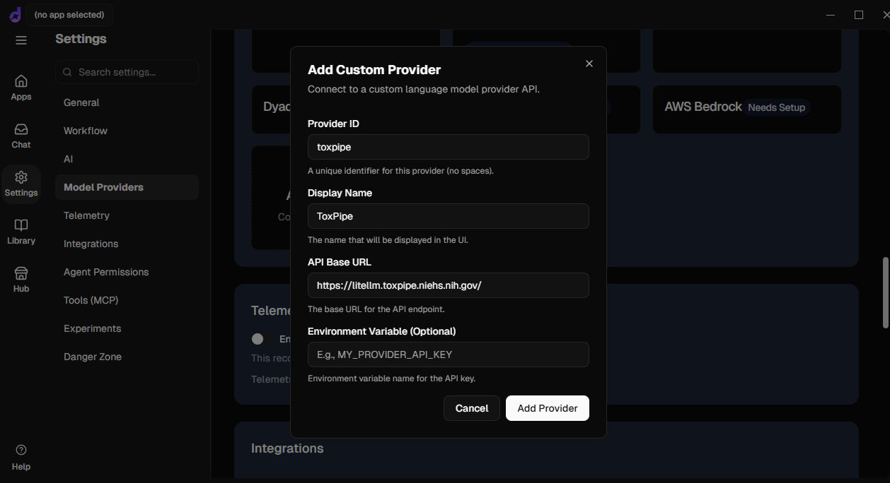
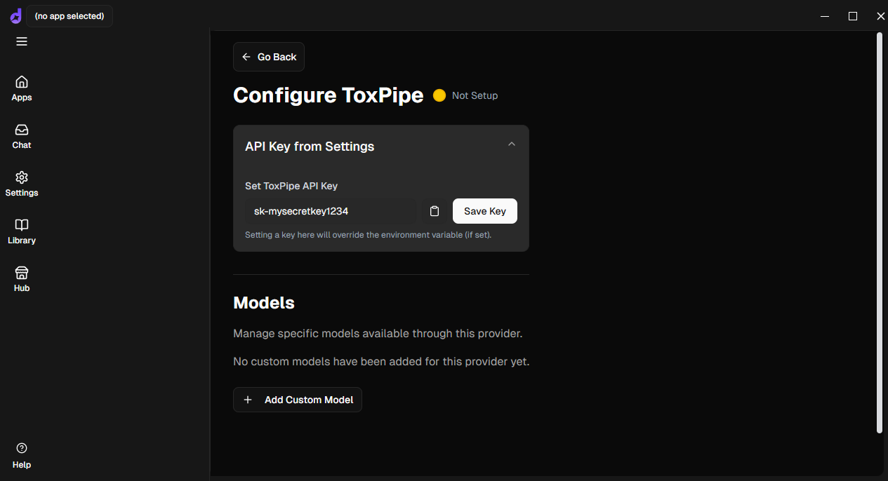
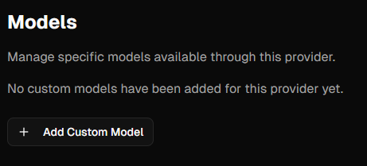
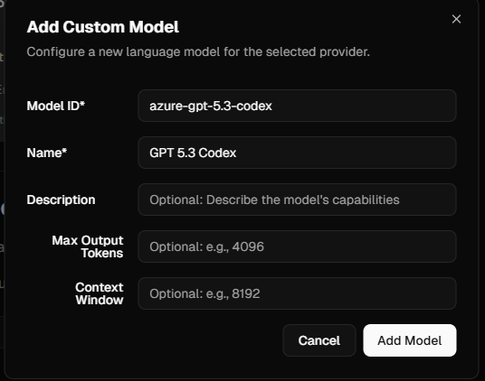

# Setting Up Dyad With ToxPipe
## Introduction
[Dyad](https://www.dyad.sh/) is an open-source tool for "vibe coding" apps using AI models. It is meant to be an alternative to proprietary tools such as Google's AI Studio and OpenAI's Codex. Dyad is available for Windows and MacOS devices. Due to security issues regarding the NIEHS' SSL certificates, some additional setup is needed to use Dyad with models provided by [ToxPipe](https://github.com/NIEHS/ToxPipe).

## Getting Dependencies
### Getting Dyad
If you want to supply your own API keys for providers like OpenAI, you can download the official Dyad releases at [https://www.dyad.sh/download](https://www.dyad.sh/download). However, if you want to use ToxPipe models, you will need to build Dyad from source. You can visit the [Dyad GitHub repository](https://github.com/dyad-sh/dyad/releases) to download releases. Find a release you would like to download, and download the **Source code (zip)** (or clone the repository) to your machine.

### Getting Node.js
Dyad requires Node.js (>= v24) to run. Node.js can be downloaded at [https://nodejs.org/en/download](https://nodejs.org/en/download). Select the proper operating system and architecture and download the prebuilt installer:

### Getting the NIEHS SSL certificates
You may download the ToxPipe SSL certificate .pem file here: [https://github.com/NIEHS/ToxPipe-Public-Certs/blob/main/toxpipe.niehs.nih.gov.pem](https://github.com/NIEHS/ToxPipe-Public-Certs/blob/main/toxpipe.niehs.nih.gov.pem)

## Setup Dyad
Once Node.js is installed on your system, open a terminal/command prompt/PowerShell and navigate to the folder where you downloaded the Dyad source code. Run the following commands:
1. `npm config set cafile /directory/where/you/downloaded/the/certificates/toxpipe.niehs.nih.gov.pem` - this tells Dyad where your certificates are stored and to use them
2. `npm install` - this installs the packages and other dependencies needed by Dyad
3. `npm run start` - this runs Dyad

Upon running `npm run start`, Dyad will start up. Note that this may take a few minutes. You must run this command from this folder to run Dyad in the future.

## Configure ToxPipe Models
Once Dyad is running, click the **Settings** button on the left-hand side menu:

In the settings menu, click **Model providers**:

Click **Add custom provider**:

Fill out the information on the menu that pops up. Use the URL for ToxPipe's LiteLLM deployment, [https://litellm.toxpipe.niehs.nih.gov/](https://litellm.toxpipe.niehs.nih.gov/), in the **API Base URL** field. Click **Add provider** to complete the configuration process.

Next, we need to add the API key. Click on the new button for the ToxPipe provider you just added. Type your provisioned ToxPipe LiteLLM API key into the field and click **Save Key**.

The connection to the ToxPipe LiteLLM API is now complete; however, we need to still specify which models are available to Dyad. Click the **+ Add Custom Model** button to open a new menu where we can specify a model.

Fill out the fields in the new menu. Only the **Model ID** and **Name** fields are required. Note that the **Model ID** value *must* be a recognized model name in LiteLLM. A list of available models can be found here: [https://litellm.toxpipe.niehs.nih.gov/models?return_wildcard_routes=false&include_model_access_groups=false&only_model_access_groups=false&include_metadata=false](https://litellm.toxpipe.niehs.nih.gov/models?return_wildcard_routes=false&include_model_access_groups=false&only_model_access_groups=false&include_metadata=false).

Recommended models are below:
- `azure-gpt-5.3-codex`
- `azure-gpt-5.4`
- `gemini-3.1-pro`
