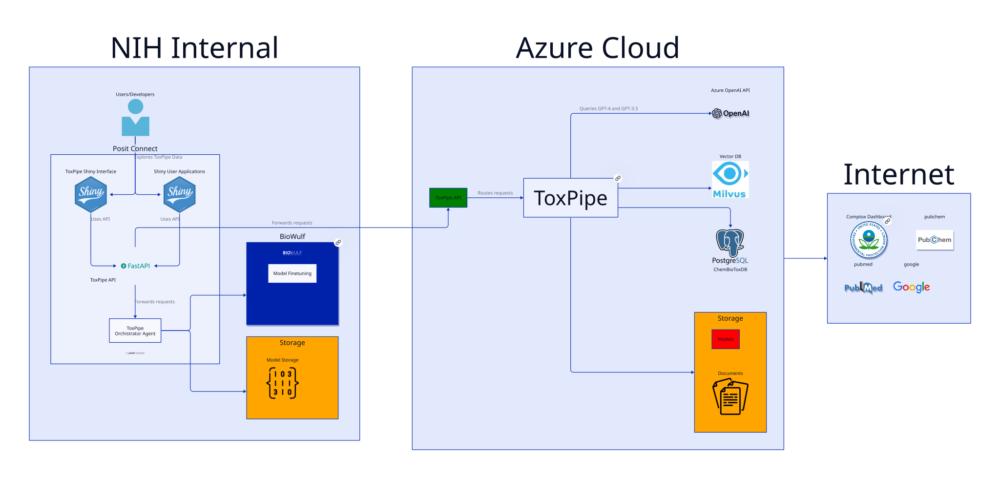

## Abstract

We introduce ToxPipe, a pioneering project aiming to harness expert entrained AI-based systems and cloud computing to revolutionize analysis and interpretation toxicological applications. ToxPipe uses large language models (LLMs) as well as AI orchestration platforms like LlamaIndex and Langflow to facilitate the exploration of toxicologically relevant data through natural language instructions. Users can interact with ToxPipe and semi-autonomous AI agents through a web-based chat interface, LLM workflow builder, and application programming interface (API). ToxPipe can be deployed in a modular and secure environment with its fully containerized application stack. We first describe the design and implementation of ToxPipe, discussing various components of the framework such as LibreChat, LiteLLM, and promptfoo. Next, we demonstrate its flexibility on key tasks of toxicological question and answer, retrieval augmented generation on a novel toxicological publication data set, and synthesis of new discoveries from internal data sources, including National Toxicology Program (NTP) Technical Reports and ChemBioTox. We then evaluate its performance against a set of defined metrics and performance indicators, including both objective measures and comparison against subject-matter experts. In conclusion, ToxPipe represents a groundbreaking initiative in computational toxicology, combining an intuitive LLM chat interface, and custom data integration, agentic workflows and evaluation frameworks to advance toxicological workflows and scientific knowledge discovery.

## Introduction

In recent years, the field of toxicology has experienced an unprecedented surge in data availability. This explosion of information stems from advancements in high-throughput screening technologies, -omics approaches, and the digitization of historical toxicological records. The sheer volume and diversity of data now available to toxicologists present both opportunities and challenges. On one hand, this wealth of information has the potential to revolutionize our understanding of chemical toxicity, biological responses, and risk assessment. On the other hand, it has created a pressing need for more sophisticated tools to manage, analyze, and interpret this complex array of data effectively.

Artificial Intelligence (AI) has emerged as a promising solution to handle the growing complexity of toxicological data. Early applications of AI in toxicology focused primarily on predictive modeling, such as quantitative structure-activity relationship (QSAR) models for predicting chemical toxicity. More recently, machine learning algorithms have been employed to analyze high-throughput screening data, identify patterns in gene expression profiles, and predict adverse outcomes from chemical exposures. The U.S. Environmental Protection Agency's Toxicity Forecaster (ToxCast) program, for instance, has leveraged AI to screen thousands of chemicals for potential toxicity, demonstrating the power of these approaches in accelerating the pace of toxicological research.

The exponential growth in toxicological data presents a significant challenge for researchers and risk assessors. This includes not only the sheer quantity of information but also its heterogeneity. Toxicologists must now contend with diverse data types, including molecular structures, in vitro assay results, in vivo studies, epidemiological data, and literature-derived information. Integrating and making sense of these varied data sources requires sophisticated analytical approaches that go beyond traditional statistical methods.

Conventional approaches to toxicological data analysis, while valuable, are increasingly strained by the complexity of modern datasets. Traditional statistical methods often struggle to capture the intricate relationships between multiple variables or to efficiently process large-scale, high-dimensional data. Moreover, these methods typically require significant human intervention and expertise, limiting the speed and scale at which analyses can be conducted.

One of the most pressing challenges in toxicology is the effective integration of data from disparate sources. Each data type – from chemical structures to gene expression profiles to epidemiological studies – provides a piece of the toxicological puzzle. However, combining these pieces into a coherent, comprehensive understanding of chemical toxicity remains a significant hurdle. The ability to seamlessly integrate and interpret data from multiple sources is crucial for advancing toxicological research and improving risk assessment processes.

The rapid pace of data generation in toxicology creates a need for real-time processing and interpretation capabilities. As new studies are published, new chemicals are synthesized, and new data become available, toxicologists require tools that can quickly incorporate this information into existing knowledge frameworks. The ability to rapidly update risk assessments, identify emerging threats, and provide timely guidance to decision-makers is increasingly critical in protecting public health and the environment.

These challenges underscore the need for innovative approaches that can handle the volume, variety, and velocity of modern toxicological data. The following sections will explore how AI, particularly large language models and advanced data integration techniques, are being leveraged to address these challenges and revolutionize toxicological research and risk assessment.

The application of AI in toxicology has rapidly evolved in recent years, moving beyond simple predictive models to more sophisticated, data-driven approaches. Machine learning algorithms, particularly deep learning models, have shown promise in various toxicological applications. For instance, convolutional neural networks have been used to predict chemical toxicity from molecular structures, while recurrent neural networks have been applied to analyze time-series toxicological data. These advancements have enabled more accurate predictions of toxicological endpoints and have improved our understanding of complex dose-response relationships.

Large Language Models (LLMs) represent the latest frontier in AI applications for toxicology. These models, trained on vast amounts of text data, have demonstrated remarkable capabilities in natural language understanding and generation. In the context of toxicology, LLMs offer the potential to process and interpret unstructured text data from scientific literature, regulatory documents, and clinical reports, extracting valuable insights that might otherwise remain hidden in the vast sea of available information.

Retrieval-Augmented Generation (RAG) is an innovative approach that combines the strengths of large language models with information retrieval systems. In the context of toxicology, RAG allows AI models to access and incorporate relevant information from extensive databases or document collections when generating responses or analyses. This approach addresses one of the key limitations of traditional LLMs: their reliance on pre-trained knowledge that may become outdated.

RAG enables toxicologists to leverage the latest research findings, regulatory updates, and experimental data in real-time, enhancing the accuracy and relevance of AI-generated insights. For example, when queried about a specific chemical's toxicity profile, a RAG-enabled system can retrieve the most up-to-date information from toxicological databases, recent publications, and regulatory documents, synthesizing this information to provide a comprehensive and current assessment.

Despite these advancements, current AI approaches in toxicology face several limitations:

- Data quality and bias: AI models are only as good as the data they are trained on. Inconsistencies, gaps, or biases in toxicological datasets can lead to unreliable or skewed predictions.
- Interpretability: Many advanced AI models, particularly deep learning models, operate as "black boxes," making it challenging to understand the reasoning behind their predictions. This lack of transparency can be problematic in regulatory and clinical settings where decision-making processes need to be clearly justified.
- Domain specificity: General-purpose AI models often lack the specialized knowledge required for nuanced toxicological assessments. Adapting these models to the specific terminology, concepts, and reasoning patterns used in toxicology remains a challenge.
- Integration of multi-modal data: While progress has been made, effectively integrating diverse data types (e.g., chemical structures, genomic data, and clinical outcomes) into a single AI framework remains challenging.
- Handling of uncertainty: Toxicological assessments often involve significant uncertainties. Current AI models may struggle to accurately represent and communicate these uncertainties in their outputs.

ToxPipe is an innovative AI-driven platform designed to address the current challenges and limitations in toxicological data analysis. At its core, ToxPipe leverages state-of-the-art LLMs, enhanced with domain-specific knowledge in toxicology. The platform's architecture is modular and scalable, allowing for easy integration of new data sources and analytical tools as they become available.

Key components of ToxPipe include:

- A natural language interface that allows toxicologists to query complex toxicological questions in plain language.
- A sophisticated data integration layer that harmonizes information from diverse sources, including scientific literature, regulatory databases, and experimental results.
- An AI-driven analysis engine that combines LLMs with specialized toxicological knowledge and reasoning capabilities.
- A visualization module that presents results in an intuitive, interpretable format for researchers and decision-makers.

ToxPipe's capabilities are built upon three key technological pillars:

- Large Language Models (LLMs): ToxPipe utilizes advanced LLMs that have been fine-tuned on toxicological literature and data, enabling them to understand and generate domain-specific content with high accuracy.
- Retrieval-Augmented Generation (RAG): By incorporating RAG, ToxPipe ensures that its analyses are always based on the most current and relevant information available. This feature allows the system to dynamically retrieve and incorporate new data as it becomes available, ensuring up-to-date and comprehensive toxicological assessments.
- Agentic workflows: ToxPipe implements an innovative agentic approach, where the AI system can autonomously plan and execute multi-step analytical processes. This feature allows ToxPipe to break down complex toxicological queries into manageable sub-tasks, execute these tasks using the most appropriate tools and data sources, and synthesize the results into coherent, actionable insights.

Recognizing the sensitive nature of much toxicological data, ToxPipe has been designed with robust privacy and security measures. The platform employs end-to-end encryption, granular access controls, and audit trails to ensure data integrity and confidentiality. Furthermore, ToxPipe can be deployed in on-premises environments, allowing organizations to maintain full control over their data while still leveraging the power of advanced AI analytics.

The primary objective of this study is to rigorously assess ToxPipe's capabilities in integrating and interpreting diverse toxicological datasets. We aim to evaluate the platform's ability to:

- Seamlessly combine information from multiple sources, including scientific literature, regulatory reports, and experimental data.
- Accurately interpret complex toxicological concepts and relationships.
- Generate coherent and relevant responses to a wide range of toxicology-related queries.

To achieve this, we will subject ToxPipe to a series of increasingly complex tasks, ranging from basic information retrieval to advanced data synthesis and hypothesis generation.

A crucial aspect of our evaluation is to benchmark ToxPipe's performance against both traditional computational methods and human expert assessments. This comparison will help us understand:

- The efficiency gains offered by ToxPipe in terms of speed and scale of analysis.
- The accuracy and reliability of ToxPipe's outputs compared to established methodologies.
- The potential of ToxPipe to augment and enhance human expert analysis rather than replace it.

We will employ a range of quantitative metrics, including precision, recall, and F1 scores, as well as qualitative assessments by toxicology experts to provide a comprehensive evaluation of ToxPipe's performance.

To push the boundaries of what's possible with AI in toxicology, we will evaluate ToxPipe's performance on a set of challenging, open-ended toxicological problems. These will include:

- Analyzing the potential toxicological implications of newly synthesized chemicals with limited available data.
- Identifying potential interactions between multiple chemicals in complex mixtures.
- Predicting long-term health effects based on short-term exposure data.
- Synthesizing information across species and exposure routes to inform human health risk assessments.

Through these assessments, we aim to understand both the current capabilities and the future potential of AI-driven systems like ToxPipe in advancing toxicological research and risk assessment.

The development and validation of ToxPipe have far-reaching implications for the field of toxicology:

- Accelerated research: By automating the integration and initial analysis of vast amounts of toxicological data, ToxPipe can significantly speed up the research process, allowing scientists to focus on hypothesis generation and testing.
- Enhanced risk assessment: ToxPipe's ability to quickly synthesize information from diverse sources can lead to more comprehensive and timely risk assessments, potentially identifying hazards that might be missed by traditional approaches.
- Improved reproducibility: The systematic, AI-driven approach of ToxPipe can help standardize data analysis procedures, potentially improving the reproducibility of toxicological studies.
- Bridging data gaps: ToxPipe's advanced analytical capabilities may help researchers make more informed predictions about chemicals with limited toxicological data, supporting efforts to reduce animal testing.

Beyond research, ToxPipe has the potential to impact regulatory processes and public health initiatives:

- Regulatory efficiency: By rapidly processing and synthesizing large volumes of toxicological data, ToxPipe could help streamline regulatory review processes, potentially accelerating the assessment of new chemicals and pharmaceuticals.
- Emergency response: In cases of chemical spills or exposures, ToxPipe could provide quick, comprehensive toxicological profiles to support rapid decision-making and intervention.
- Environmental monitoring: ToxPipe could be used to continuously analyze emerging data on environmental contaminants, helping to identify potential threats to public health more quickly.
- Consumer safety: By enhancing our ability to predict and understand chemical toxicity, ToxPipe could contribute to the development of safer consumer products and more effective risk communication strategies.

Finally, this study contributes to the broader field of AI applications in scientific research:

- Domain-specific AI: ToxPipe demonstrates the potential of highly specialized AI systems tailored to the unique needs and challenges of a scientific domain.
- Interpretable AI: Through its use of natural language interfaces and explainable AI techniques, ToxPipe addresses the critical need for transparency and interpretability in AI-driven scientific analysis.
- Human-AI collaboration: By design, ToxPipe aims to augment rather than replace human expertise, providing a model for effective human-AI collaboration in complex scientific domains.
- Ethical AI in science: The development of ToxPipe, with its emphasis on data privacy and security, offers insights into the responsible deployment of AI in sensitive scientific and regulatory contexts.

In conclusion, this study of ToxPipe not only promises to advance the field of toxicology but also provides valuable insights into the broader potential of AI to transform scientific research and decision-making processes. The following sections will detail our methodology, present our results, and discuss their implications for the future of toxicological research and risk assessment.

## Data & Methods {#sec-data-methods}

Our study aimed to evaluate the accuracy and capabilities of various artificial intelligence (AI) models in answering toxicology-related questions. We designed a multi-tiered approach to assess model performance across different levels of complexity, focusing on 20 carefully selected chemicals. These chemicals were chosen to represent a spectrum of available toxicological information, ranging from well-documented compounds to novel substances with minimal data. To comprehensively evaluate the models, we developed multiple sets of questions, including general toxicology queries applicable to all chemicals, specific questions targeting National Toxicology Program (NTP) reports, and questions derived from the Diplomate of the American Board of Toxicology (DABT) examination. 

To ensure data privacy and enable customized model interactions, we developed a private infrastructure utilizing several key components. We employed Librechat as a platform for interacting with multiple AI models, Light LLM as a proxy service for standardized API calls, Lang Fuse for enhanced logging and tracing of model interactions, and Prompt Foo, an open-source command-line tool, for programmatic testing of prompts across different models. This infrastructure allowed us to maintain control over sensitive data while enabling comprehensive evaluation of various AI models.

Our evaluation framework consisted of three distinct levels designed to assess model performance under different conditions. Level 1, or zero-shot evaluation, involved querying the models without additional context or information, aiming to assess their baseline knowledge and capabilities in toxicology. Level 2 implemented Retrieval Augmented Generation (RAG), where models were provided with relevant information through an advanced search mechanism. This level utilized semantic search and reranking to enhance context, evaluating the models' ability to leverage provided information effectively. Level 3 introduced an agentic approach, equipping models with the ability to choose tools and data sources. This level implemented an agent-based framework allowing for multi-step reasoning, aimed at assessing more advanced problem-solving capabilities in toxicological contexts.

### Implementation Stack

{#fig-toxpipe-architecture}

The primary user interface for ToxPipe is presented in the form of a Dashy dashboard. This dashboard showcases the primary applications available within the ToxPipe platform. Dashy also offers additional functionality, including uptime indicators, end-user customization options, and administrative views. As the gateway to the rest of the application stack, the Dashy management homepage makes it easy for users to view relevant information quickly and efficiently.

To facilitate more direct interactions with Large Language Models (LLMs), ToxPipe incorporates LibreChat as a web-based chat interface (Avila, 2024). LibreChat is modeled after the familiar OpenAI ChatGPT interface but is released under an MIT open-source license, making it freely available for use and modification. LibreChat includes most features available in the ChatGPT interface while adding some of its own unique capabilities. These additional features make it particularly easy to deploy and share AI agents and assistants within the ToxPipe ecosystem.

Many LLM providers have their own API schemas with slight differences, which can create complexity in integration and management. To address this issue, ToxPipe integrates LiteLLM as an LLM proxy to reduce complexity within the ecosystem. Instead of integrating all the model providers independently, all LLM calls are written against the Azure OpenAI API and routed through LiteLLM. This approach simplifies developer onboarding for novel use cases and provides administrators with fine-tuned controls on model usage and budgeting. By standardizing the API interface, LiteLLM allows for greater flexibility in model selection and easier management of multiple LLM providers.

Langfuse is incorporated into ToxPipe as an LLM logging, monitoring, and debugging platform. With Langfuse, developers can get a comprehensive overview of LLM output for their own projects. They can follow traces for individual conversations or workflows, as well as analyze token usage, latency, and other metrics that are crucial in LLM-based development. This level of insight allows for better optimization of LLM interactions and helps in identifying and resolving issues quickly.

Evaluations of LLM performance and output quality within ToxPipe were completed using promptfoo. This tool allows for systematic testing and comparison of different prompts and model configurations, ensuring that the LLMs are performing as expected and delivering high-quality results across various use cases.

To enhance flexibility and performance, locally hosted models were deployed using Ollama and routed through LiteLLM. This setup allows ToxPipe to leverage the benefits of on-premises models while maintaining a consistent interface for developers and users. Ollama simplifies the deployment and management of local models, while LiteLLM ensures seamless integration with the broader ToxPipe ecosystem.

Some workflows within ToxPipe were implemented using Langflow, a visual LLM-based workflow manager. Langflow allows users to quickly prototype workflows ranging from simple, linear processes to complex, branching, multi-agent flows. These workflows can incorporate various components such as storage solutions, APIs, search engines, and more. The visual interface of Langflow makes it accessible to both technical and non-technical users, enabling rapid development and iteration of LLM-powered applications.

The agentic API, which serves as a programmatic interface to ToxPipe's advanced AI capabilities, can be accessed after deployment. This API allows developers to integrate ToxPipe's functionalities into their own applications and services, extending the platform's capabilities beyond its native interface.

In summary, ToxPipe combines a user-friendly dashboard (Dashy) with powerful LLM interaction tools (LibreChat), efficient LLM management (LiteLLM), comprehensive monitoring (Langfuse), local model deployment (Ollama), visual workflow creation (Langflow), and an extensible API. This integrated ecosystem provides a robust platform for developing, deploying, and managing AI-powered applications in the field of toxicology and beyond.

The public agentic API may be accessed at https://rstudio.niehs.nih.gov/toxpipe-api/. The agentic API provides an interface for end users to query LLMs with access to additional tools that provide curated information not included in the base models’ training knowledge. These tools provide LLMs with access to functions for manipulating and analyzing molecules (provided by RDKit), 

This API was originally developed as a fork of the open-source tool ChemCrow, which is built using the LangChain ecosystem (Bran et al., 2023) TODO: how to cite LangChain?. It has since been expanded to take advantage of a newer version of LangChain 

### Documentation

The development of reproducible ....

### Data connections/sources

Our data sources encompassed NTP technical reports, published scientific literature, chemical databases, and proprietary toxicology resources.

Evaluation

ToxPipe was tested by .... evaluation against a set of clearly defined metrics and performance indicators, including both objective measures and comparison against subject-matter experts.	 The testing is formally documented at https://github.com/NIEHS/ToxPipe-Model-Comparison.

Can it pass the DABT?....

For process spinning off multiple agents, the evaluation metrics used include a "confidence rating", defined as the number of agents that returned that piece of information divided by the total number of agents, {n_agents} and formatted as a percentage.

For all ToxPipe generated information, we estimate both F1 scores and plot Precision-Recall Area Under the Curve (PR AUC) to compare results to those vetted by subject matter experts. The precision, or positive predictive value, is the fraction of relevant instances among retrieved instances. The recall, or sensitivity, is the fraction of relevant instances that were retrieved. The F1 score is the harmonic mean between precision and recall. The PR AUC curve visualizes the tradeoff between the two quantities Details of calculations for each example task are given below.

For task 1 annotate, we estimate an F1 Score that compares the ToxPipe annotation with a “truth” reference supplied by a subject matter expert. The F1 score places equal weight on the precision (ratio of shared tokens to the total number of tokens in the prediction) and recall (ratio of shared tokens to the total number of tokens in the truth reference). For task 2, follow-up experimental suggestions are evaluated by a panel of subject matter experts and scored <can decide scoring scale as metric or binary if we want>. For task 3, the ToxPipe results are evaluated by a panel of subject matter experts and scored <can decide scoring scale as metric or binary>.

The evaluation procedure was carried out systematically for each of the 20 selected chemicals. We ran the prepared question sets through all three evaluation levels, utilizing multiple AI models, including [specific models used]. Responses were collected and stored using Lang Fuse, enabling detailed analysis of model outputs. To ensure objective assessment, we developed a comprehensive scoring rubric to evaluate the accuracy and completeness of model responses. Two independent toxicologists reviewed and scored the model outputs, enhancing the reliability of our assessment.

Our data analysis approach was multifaceted, aimed at providing a comprehensive understanding of model performance across various dimensions. We compared model performance across the three evaluation levels for each chemical and question type, seeking to identify patterns and trends in accuracy and capability. Statistical analyses were performed to identify significant differences in performance between models and evaluation levels. We also assessed the impact of chemical information availability on model accuracy, exploring how the depth and breadth of available toxicological data influenced model responses. Additionally, we conducted qualitative analysis to identify patterns in model errors and areas for improvement, providing insights for future refinement of AI models in toxicology applications.

Throughout the study, we maintained a strong focus on ethical considerations. Our research did not involve human subjects or animal testing, relying instead on publicly available sources and properly licensed databases. We took great care to ensure that no personally identifiable information was processed by the AI models during the evaluation, maintaining the privacy and integrity of our data sources.

This comprehensive methodology allowed us to rigorously evaluate the capabilities of AI models in toxicology, providing valuable insights into their potential applications and limitations in this critical field. By assessing model performance across different levels of complexity and information availability, we aimed to contribute to the ongoing development and refinement of AI tools for toxicological research and assessment.

### Evaluation Methodology

#### Level 1: Zero-shot Characterization

In the zero-shot (or Level 1) evaluation, large language models (LLMs) are tested without providing them with any additional context or specific training for the task. This level involves asking the model to generate answers purely based on its pre-trained knowledge. For toxicological applications, this might include asking the model toxicology-related questions, such as the potential toxicity of a chemical or its effect on biological systems. The model's responses are generated directly from its built-in knowledge base, without the aid of any external data or retrieval mechanisms. This level serves as a baseline to assess how well the AI performs with no task-specific adaptation, providing insight into the general applicability of the LLM in toxicology.

#### Level 2: Retrieval-Augmented Generation (RAG)

At Level 2, the evaluation incorporates retrieval-augmented generation (RAG). In this approach, the model’s output is augmented by feeding it relevant data retrieved from external toxicological databases or reports. For example, when asked about the toxicological properties of a chemical, the model uses a semantic search engine to pull relevant data (e.g., from National Toxicology Program reports or ChemBioTox databases) and integrates this information into its response. Unlike Level 1, where the model operates on pre-trained knowledge alone, Level 2 ensures that the AI has access to up-to-date, specific information, enhancing the accuracy and relevance of its output.

#### Level 3: Agentic Workflows

Level 3 builds upon RAG but introduces agentic workflows, where the model acts in an iterative, multi-step fashion. Instead of retrieving and integrating data in a single step, the model continuously refines its answer by actively choosing which tools, databases, and information sources to consult. For instance, if the model is asked a complex toxicology question, such as the relationship between a chemical and a specific type of cancer, it will dynamically search through multiple datasets, re-evaluate the information, and potentially update its answer based on additional rounds of information gathering. This process mimics expert decision-making and reasoning, enabling the model to explore a variety of data sources and refine its conclusions through multiple iterations.

#### Level 4: Form-based, Open-ended Question Handling

In Level 4, the system progresses to handling more complex, open-ended tasks through a form-based approach. Instead of answering specific questions directly, the AI is tasked with generating comprehensive reports or filling out structured forms based on user queries. For example, a user might request a detailed toxicological profile of a new chemical, asking for the AI to populate fields such as known toxicity, exposure routes, biological effects, and regulatory status. The agentic workflow is extended here, where the AI not only retrieves and summarizes relevant data but also organizes the information into a structured format. This level allows the AI to handle open-ended questions that require synthesizing diverse sources of information into comprehensive, human-readable reports, thus pushing the boundaries of autonomous toxicological research.

## Results

Results
(1) <task 1 annotate...>.

Figure 2. Task 1 results. 

(2) <task 2 RAG interpretation of...>.

The ...experimental results and suggestion for followup experimentation>

Figure 3. Task 2 results. 

(3) synthesis of new discoveries from internal data sources.

The Division of Translational Toxicology (formerly known as the Division of the National Toxicology Program) has generated a trove of data on <describe>. Documents like National Toxicology Program Technical Reports are parsed and converted to vector embeddings, enabling semantic similarity search for user and agent queries. ToxPipe also leverages the data contained in ChemBioTox, a Postgres database that aims to compile toxicologically relevant information across a variety of publicly available data sources and QSAR models for over 1 million chemicals and their metabolites.

Figure 4. Task 3 results.

## Discussion

The overwhelming performance advantages in terms of accuracy, speed, and cost-effectiveness of ToxPipe are demonstrated by <cite results subsection XX>. For <task 1>, .... For <task 2>, .... For <task 3>....

Furthermore, the quality and scope of ToxPipe generated products is evidenced by the <evaluation by subject matter experts>.

Benefits: evaluation and testing built into results so that users can “check their work”;

Beyond scientific discovery, the potential of such systems to contribute to the administrative and strategic operations of the Translational Toxicology Division are <...ToxPipe good, real good>.

The implementation of such systems in a secure, federal environment, aligns with NIH strategic goals in data science and reproducible research <...theme 1, theme 2, ...>. The importance of documenting reproducible research in this space cannot be overstated, as NIEHS and the Division of Translational Toxicology have stakeholders in communities that <....>.

## Conclusion

ToxPipe represents a significant advance in the field of toxicological research, providing researchers with a powerful tool for quickly and accurately retrieving and interpreting toxicological information. The platform has the potential to significantly improve the efficiency and effectiveness of toxicological research and could have important implications for public health and the environment.

## References {.unnumbered}

::: {#refs}
:::

## Conflict of Interest

The authors declare that the research was conducted in the absence of any commercial or financial relationships that could be construed as a potential conflict of interest.

## Author Contributions

The Author Contributions section is mandatory for all articles, including articles by sole authors. If an appropriate statement is not provided on submission, a standard one will be inserted during the production process. The Author Contributions statement must describe the contributions of individual authors referred to by their initials and, in doing so, all authors agree to be accountable for the content of the work. Please see here for full authorship criteria.

## Funding

This project was funded by an NIH Office of Data Science Notice of Special Interest funding opportunity (NOT-OD-23-070), as well as by the NIEHS Office of Scientific Computing and Office of Data Science.

## Acknowledgments

This is a short text to acknowledge the contributions of specific colleagues, institutions, or agencies that aided the efforts of the authors. 

## Supplementary Material

Supplementary Material should be uploaded separately on submission, if there are Supplementary Figures, please include the caption in the same file as the figure. Supplementary Material templates can be found in the Frontiers Word Templates file.

Please see the Supplementary Material section of the Author guidelines for details on the different file types accepted.

## Data Availability Statement

All documentation and code for ToxPipe is available at https://github.com/NIEHS/ToxPipe. Material supporting the key tasks evaluated in this manuscript are available at https://github.com/NIEHS/ToxPipe-Model-Comparison.

The datasets [GENERATED/ANALYZED] for this study can be found in the [NAME OF REPOSITORY] [LINK]. Please see the “Availability of data” section of Materials and data policies in the Author guidelines for more details.
