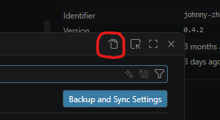

# Integrating ToxPipe Models into Visual Studio Code (VSCode)

__Note: This is tested and confirmed working on VSCode version 1.121.0. This functionality relies on third-party extensions to function: please be aware of the risks of installing and using third-party extensions and know that functionality may break between releases.__

VSCode's Copilot can be configured to use models from ToxPipe using these steps:
1. Install Johnny Zhao's ["OAI Compatible Provider for Copilot" extension for VSCode]([https://marketplace.visualstudio.com/items?itemName=Gethnet.litellm-connector-copilot](https://marketplace.visualstudio.com/items?itemName=johnny-zhao.oai-compatible-copilot)). This guide was tested with version 0.4.2 of this extension. See the code repository [here](https://github.com/JohnnyZ93/oai-compatible-copilot) for more documentation and information.
2. After the extension is installed, use `Ctrl+,` to open VSCode's settings menu.
3. Click the "Open Settings (JSON)" icon in the top right corner of the settings menu to view and edit VSCode's settings in JSON format.
    
4. Add the following configuration between the outermost curly braces `{}` of the settings JSON:
```
"oaicopilot.baseUrl": "https://litellm.toxpipe.niehs.nih.gov/",
"oaicopilot.models": [
    {
        "id": "model-name-as-it-appears-in-LiteLLM",
        ...
    },
    ... (continue as needed for however many models you want to add)
]
```
For example:
```
"oaicopilot.baseUrl": "https://litellm.toxpipe.niehs.nih.gov/",
"oaicopilot.models": [
    "oaicopilot.models": [
        {
            "id": "claude-sonnet-4.6",
            "owned_by": "anthropic",
            "context_length": 256000,
            "max_tokens": 8192,
            "temperature": 0,
            "apiMode": "anthropic"
        },
        {
            "id": "gemini-3.1-pro",
            "owned_by": "gemini",
            "context_length": 256000,
            "max_tokens": 8192,
            "temperature": 0,
            "apiMode": "gemini"
        },
        {
            "id": "azure-gpt-5.4",
            "owned_by": "openai",
            "context_length": 256000,
            "max_tokens": 8192,
            "temperature": 0,
            "apiMode": "openai"
        }
    ]
]
```
Note that the `apiMode` parameter in each model is critical to getting the model to work properly. This value must be set to the correct provider for the corresponding model. The OAI Compatible Provider for Copilot extension currently can handle the following API modes:
- openai
- openai-responses
- ollama - for local models hsoted via Ollama
- anthropic - for Claude models
- gemini - for Gemini models

5. Save your changes to the settings JSON and exit out of the settings menu.
6. Open the Copilot chat menu with `Ctrl+Alt+I` and click the "Pick Model" menu.
7. Click the gear button in the top right of the Pick Model menu to open the "Manage Language Models" menu.
8. There should now be an "OAI Compatible" category in the model list, under which are the models you added to the JSON configuration. Click the gear icon at the far right of the "OAI Compatible" header to open the "Manage OAI Compatible" menu.
9. This will open up a prompt for your OAI Compatible API key. Insert your provisioned ToxPipe LiteLLM API key here (it will be stored locally on your machine).
10. If they are not already pinned, you may click the pin icon that appears to the right of the model entry when hovering over each model in the model list to pin them to the quick "Pick Model" menu.
11. You may now open the "Pick Model" menu and click your model from ToxPipe to use it.
