# D2 Test

```{.d2}
x { 
  link: "https://quarto.org"
}
y {
  tooltip: "This is a tooltip"
}
x -> y -> z
```

# [Will the slides be shared?]{style="font-size: 10vh;"} {style="text-align: center; margin-top: 10vh;"}

::: {.fragment}
Yes, in fact this presentation is already uploaded to
:::

::: {.fragment}
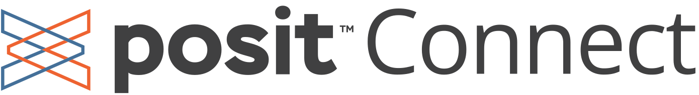{style="height: 10vh;"}
:::

::: {.fragment}
You can type in **<https://bit.ly/naehsc-toxpipe>** into your browser to access the
presentation.
:::

::: {.fragment}
<br>

[This presentation was created using:]{style="font-size: 7vh;"}

::: columns
::: {.column width="50%"}
[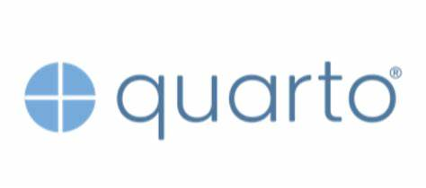](https://quarto.org)
:::

::: {.column width="50%"}
[](https://revealjs.com/)
:::
:::
:::

::: notes
So one question that I always get is, "Will the slides be shared?" Yes! I've
already uploaded them to our Posit Connect server, and you can follow along with
me there. The link is rstudio.niehs.nih.gov/whatever.
:::

# My AI Story {.center style="text-align: center; font-size: 10vh; margin-top: 10vh;"}

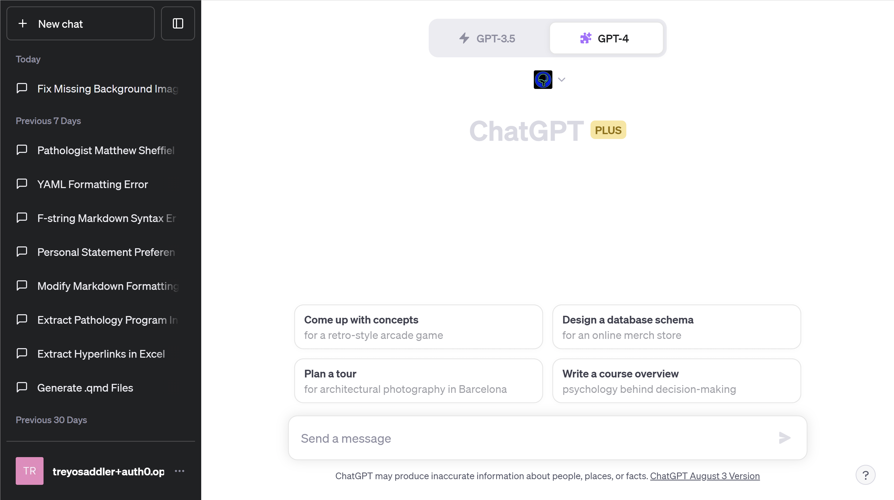{.r-stretch fig-align="center" width="3470"}

::: notes
When I first used ChatGPT in December of last year, I thought that the
technology was neat, but I didn't see the full potential. Then in January and
February, I watched a few YouTube videos that showed some of the abilities that
ChatGPT had. It was then that I realized that this technology could be used to
solve some of the problems that we were facing in our research.
:::

# Did I go overboard? {style="text-align: center; font-size: 5vh; margin-top: 15vh;"}

::: {.fragment}
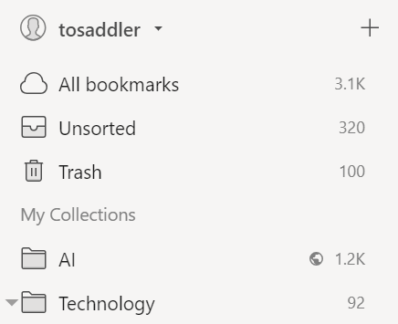
:::

::: {.fragment}
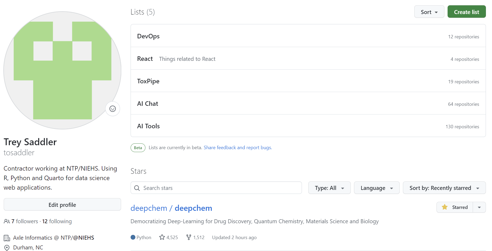
:::

::: notes
So since the beginning of the year, I've completely immersed myself in the world
of AI and machine learning. I've read hundreds of articles and watched dozens of
videos. I've also spent a lot of time playing around with various AI
technologies, including ChatGPT, ChemCrow, and others. I've also spent a lot of
time thinking about how these technologies could be used to solve problems in
environmental health sciences, especially in understanding GxE interactions.
:::

# Introduction {style="text-align: center; font-size: 5vh; margin-top: 12vh;"}

::: columns
::: {.column width="50%"}
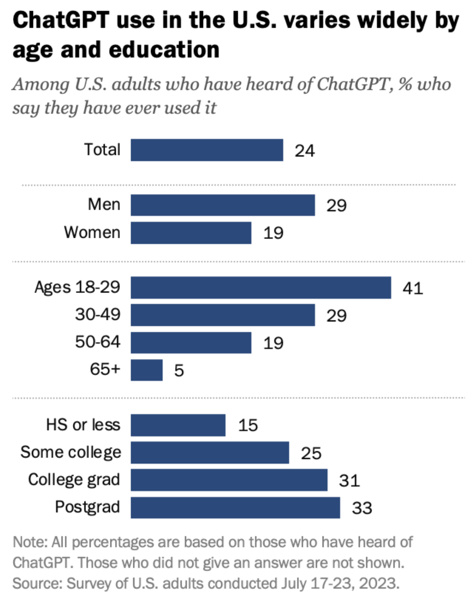
:::

::: {.column width="50%"}
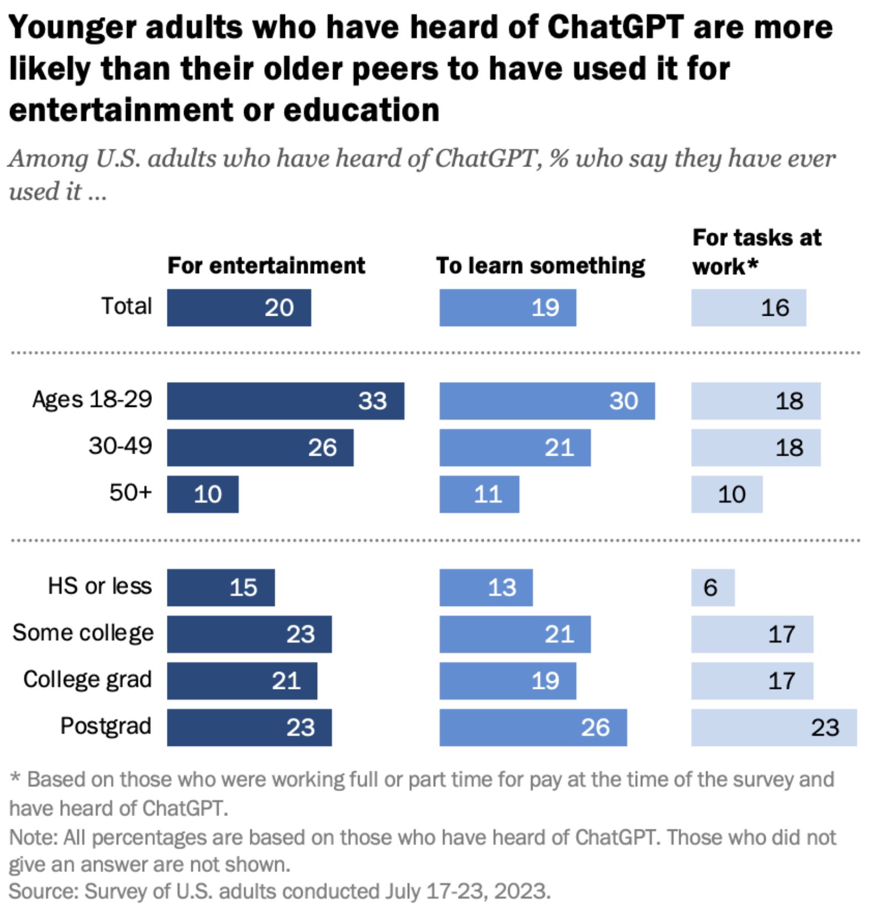
:::
:::

[Most Americans haven't used ChatGPT; few think it will have a major impact on
their job \| Pew Research
Center](https://www.pewresearch.org/short-reads/2023/08/28/most-americans-havent-used-chatgpt-few-think-it-will-have-a-major-impact-on-their-job/)

::: notes
Once it clicks, you'll become as excited as I am! And maybe as scared as well.
The last time that this council was held, ChatGPT had only been out for a few
months. It had already been causing a stir, but the landscape has changed
dramatically in the past 6 months.
:::

# Agenda

-   Intro
-   DTT and Current Initiatives
-   ToxPipe
-   Addressing Concerns: Security, Privacy, and Accuracy
-   Future Plans for ToxPipe
-   Conclusion

::: notes
Notes about the agenda.
:::

# What is the National Toxicology Program? {#sec-what-is-the-national-toxicology-program}

[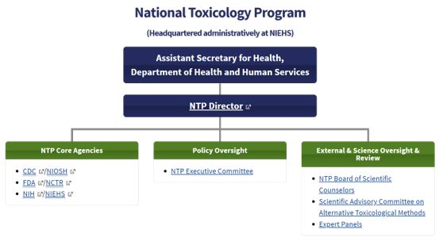{height="700px"}](.center)

Notes: We realize in particular that large language models may be able to
increase our productivity for most of our products

::: notes
Who is NTP? First a little background on the NTP, although I imagine many of you
know this.

The National Toxicology Program (NTP) is an inter-agency program founded in 1978
that is run by the United States Department of Health and Human Services and is
headquartered at NIEHS.

The role of the NTP is to coordinate \[toxicological\] testing across the
federal government. It's responsible for generating, interpreting, and sharing
toxicological information about potentially hazardous substances in our
environment. 

Another critical role of the NTP that has become more prominent in recent years
is the evaluation of new test methods such as the genomic dose response studies.

NTP was established to: - Test chemicals of public health concern - Develop and
validate new and better integrated test methods - Provide needed information to
regulatory and research agencies - Strengthen the science base in toxicology
https://ntp.niehs.nih.gov/whoweare/history
:::

```{r}

```

# What is the Division of Translational Toxicology?

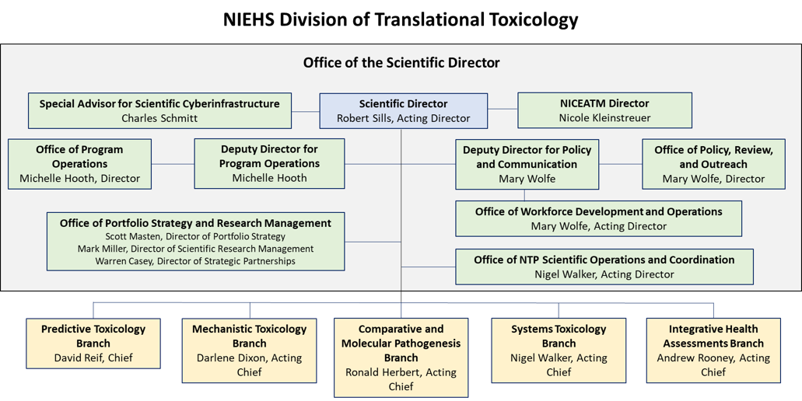{fig-align="center" height="700"}

::: notes
The DTT at NIEHS (lower right) is the division formerly known as the Division of
the National Toxicology Program, aka DNTP -- I know, very confusing.

The DTT holds the primary leadership role in the NTP interagency program.
:::

# What are some NTP/DTT Products?

[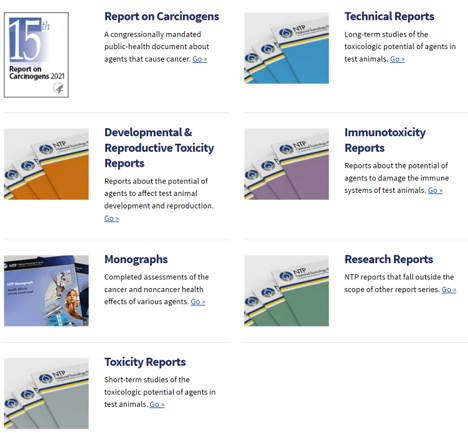{height="700px"}](.center)

::: notes
Both the NTP and the DTT produce several toxicological assessment products that
range from systematic review reports, to various specific guideline and
non-guideline level toxicological assessments that are used by regulatory
agencies across the globe.

In recent years there has been an increased demand from our stakeholders to
formulate more timely approaches and products that can support risk assessment.

These approaches include a number of new approach methods including the in vivo
genomic dose response studies that can rapidly identify a
transcriptomics/molecular point of departure.
:::

# Brief Overview of Current Large Language Model capabilities

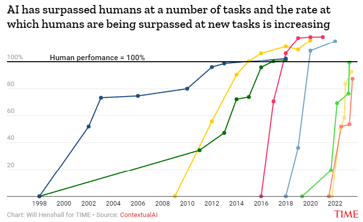{fig-align="center" height="100vh"}

::: notes
I'm going to go more in depth on all things AI and Large Language Models
shortly, but before I do I just quickly wanted to mention some of the recently
improved capabilities of these models and how we're thinking about and trying to
apply the latest advancements in AI to our work.

First, interpretation. We've all seen the amazing capabilities of these models
to generate text, but they can also be used to interpret text. For example, we
can use these models to extract information from text, to summarize text, and to
answer questions about text.

https://contextual.ai/plotting-progress-in-ai/
https://time.com/6300942/ai-progress-charts/ https://paperswithcode.com/
:::

# Kamel's Project

Talk about Kamel's Project

::: notes
Notes go here.
:::

# Andy's OHAT

Talk about DExtr and other uses for LLMS in systematic review

::: notes
Notes go here.
:::

# ChemBioTox

-   Question answering - ChemBioTox
    -   Comprehensive reports on Toxicity

::: notes
Notes go here.
:::

# ChemCrow: from text to chemical production

-   https://arxiv.org/abs/2304.05376
-   https://github.com/ur-whitelab/chemcrow-public

::: notes
Some more notes
:::

# Introduction to ToxPipe (15 minutes)

-   The problem ToxPipe aims to solve in the context of GxE interactions and
    multi-omic integration
-   How ToxPipe works: semi-autonomous AI agents and data-augmented prompt
    engineering
-   Demonstration of ToxPipe in action: generating toxicological narratives and
    answering general toxicological questions by integrating various data
    sources, including PubMed, PubChem, EPA Comptox Dashboard, and other
    toxicological databases and data sets
-   How ToxPipe can aid in understanding and predicting GxE interactions

::: notes
Notes go here.
:::

# Generative AI and production challenges

-   Creating an app is easy
-   Creating a production-ready app is hard
-   \[Demonstrate the various frontend apps tried\]

::: notes
-   Notes go here.
:::

# Addressing Concerns: Security, Privacy, and Accuracy (10 minutes)

-   Explanation of the security measures in place for ToxPipe
-   How ToxPipe ensures user privacy
-   The steps taken to ensure the accuracy of ToxPipe's outputs, especially in
    the context of GxE interactions and multi-omic data
-   How ToxPipe handles errors and inaccuracies
-   The role of human oversight in ToxPipe's operations
-   "Here's what we have done to address these concerns with our implementation"

::: notes
-   Insert notes here
:::

# Future Plans for ToxPipe

TODO

::: notes
-   Insert notes here
:::

# Incorporate additional Data Sources

-   EPA Comptox Dashboard
-   Tox21
-   PubMed

::: notes
-   Insert notes here
:::

# Conclusion and Call to Action

-   Recap of the key points from the presentation
-   The potential impact of ToxPipe on the field of environmental health
    sciences, particularly in understanding GxE interactions
-   Call to action: how the audience can get involved or support ToxPipe

# Q&A Session

-   Open the floor for questions and discussion
